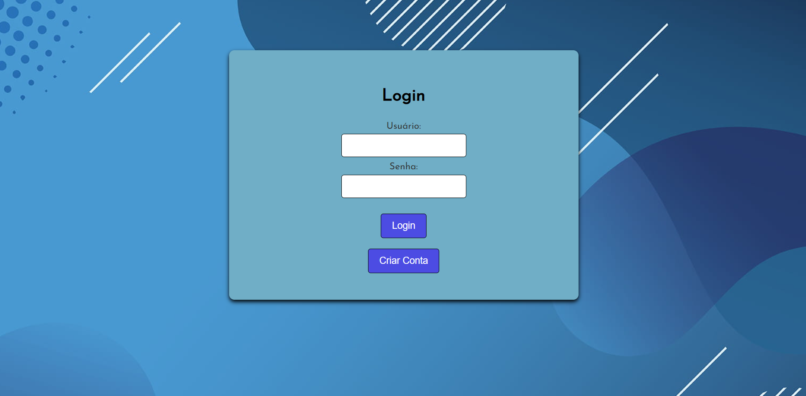
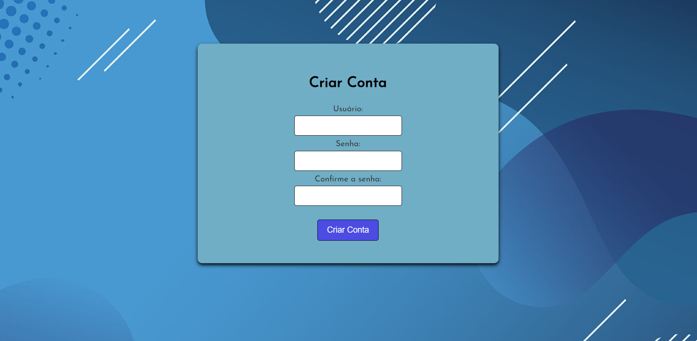

# Tela de Login

## Link do projeto
 https://tela-de-login-ctd.netlify.app

Este é um projeto de um site com uma tela de Login dinâmica que muda o formulário de Login para o formulário de Criar Conta (ou Sign Up) na mesma página, usando Javascript. 

## Tabela de Conteúdos

- [Meu Processo de Desenvolvimento](#meu-processo-de-desenvolvimento)
- [Instruções](#instruções)
- [Autor do Projeto](#autor-do-projeto)

## Meu processo de Desenvolvimento

Este é o primeiro projeto em que eu começo a explorar o Javascript sozinho, ou seja, sem orientação de instrutores. Os meus primeiros contatos com Javascript foram nos cursos da Alura, quando eu aprendi a criar um jogo de Pong no P5.js (https://p5js.org/) e um jogo no estilo "Frogger" chamado Freeway, além de um site interativo com sons de instrumentos chamado Alura MIDI, todos com orientações dos instrutores/professores da Alura. Para este meu primeiro projeto pessoal, queria criar uma interação simples que eu pudesse fazer com o Javascript, foi aí que pensei em fazer um site com uma tela de login dinâmica aonde eu pudesse mudar da tela de Login para Sign Up em uma mesma página usando as funções de ocultar e exibir objetos no Javascript. Com relação ao HTML e CSS, decidir fazer algo simples para eu focar no Javascript, então é somente uma página com tela de fundo azul e o formulário de Login (e depois a mudança pro formulário de Sign Up usando o Javascript). Com relação às informações de usuário e senha, ainda não consegui resolver a questão do banco de dados para armazenar estas informações para serem usadas no Login, considerando que este é meu primeiro projeto pessoal e eu estar iniciando no Javascript, então a solução que encontrei, para não precisar colocar informações específicas (por exemplo, se eu usar admin de usuário e admin de senha, a mensagem do navegador será "Login feito com sucesso!), foi colocar de uma forma que, para a mensagem de "Login feito com sucesso!" aparecer no navegador, eu tenha que entrar com um nome de usuário diferente da senha, então qualquer nome de usuário é válido e qualquer senha também é válida para "entrar na sua conta". Já na tela de Sign Up (Criar Conta), qualquer informação inserida ali o navegador exibirá uma mensagem de "Conta criada com sucesso!" e, logo em seguida, a página mudará novamente para a tela de Login. No caso de inserção de dados incorreta, para simular este evento, é só colocar o usuário e senha com o mesmo nome, aí aparecerá a mensagem no navegador de "Senha ou nome de usuário incorreta". Enfim, o meu objetivo com tudo isso foi simular uma criação de conta neste site e, logo em seguida, o Login no referido site.

## Instruções
1- Clicar em Criar Conta;
2- Inserir nome de usuário e senha;
3- Repita novamente a senha;
4- Clique em Criar Conta;
5- Inserir nome de usuário e senha "criados";
6- Clique em Login.

## Autor do Projeto

- GitHub - [Gabriel-L-Santos](https://github.com/Gabriel-L-Santos)
- LinkedIn - [Gabriel Leme dos Santos](https://www.linkedin.com/in/gabriel-leme-dos-santos/)